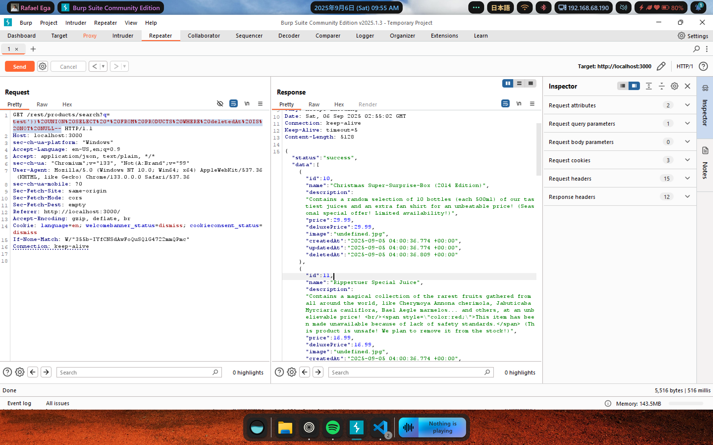
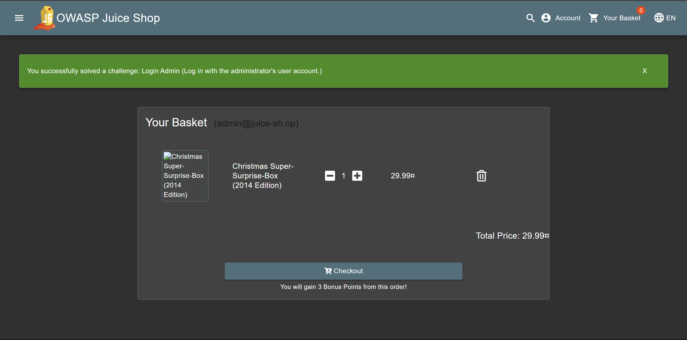

# Soal Christmas Special

**Description:** Order the Christmas special offer of 2014.

**Resource:** https://demo.owasp-juice.shop/#/score-board?categories=Injection&showDisabledChallenges=false

## Langkah Pengerjaan:
1. Karena sebelumnya sudah diketahui bahwa `127.0.0.1:3000/rest/products/search?q=payload` bisa diinfiltrasi dengan SQL injection, saya akan memanfaatkan kembali URL ini
2. Saya menggunakan query `test'))%20UNION%20SELECT%20*%20FROM%20PRODUCTS%20WHERE%20deletedAt%20IS%20NOT%20NULL--` untuk mengambil data produk yang telah dihapus sebelumnya

3. Berhasil mendapatkan informasi mengenai produk yang sudah dihapus, dan langsung bisa diketahui id produk "Christmas Super-Surprise-Box (2014 Edition)" adalah 10
4. Sekarang untuk bisa melakukan pemesanan pada barang yang sudah dihapus, saya kembali menggunakan BurpSuite untuk intercept request yang dikirimkan ketika pemesanan yang sebenarnya terjadi
5. Berhasil mendapatkan request `POST /api/BasketItems/ HTTP/1.1` yang digunakan untuk menambahkan item ke keranjang belanja
6. Mengganti id produk menjadi id produk Christmas Special yakni 10.
7. Karena id produk sudah sesuai, maka item yang terhapus bisa masuk ke dalam keranjang

8. Melanjutkan proses checkout untuk menyelesaikan challenge

Soal ini berhasil diselesaikan dengan mengikuti petunjuk pada write-up di https://github.com/Whyiest/Juice-Shop-Write-up/blob/main/4-stars/christmas_special.md