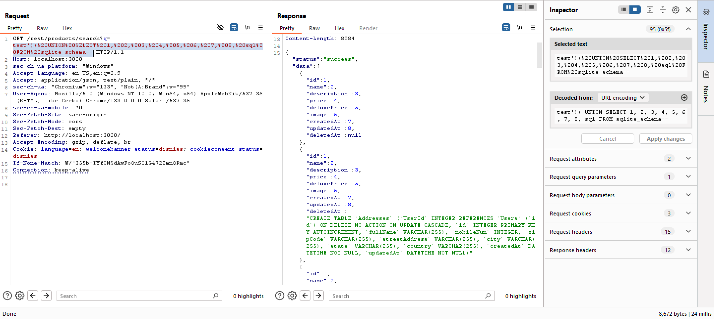

# Soal Database Schema

**Description:** Exfiltrate the entire DB schema definition via SQL Injection.

**Resource:** https://demo.owasp-juice.shop/#/score-board?categories=Injection&showDisabledChallenges=false

## Langkah Pengerjaan:
1. Lakukan pencarian random pada home page untuk mengetahui URL yang digunakan untuk search function
2. Berhasil mendapatkan URL `127.0.0.1:3000/rest/products/search?q=payload`
3. Dengan menggunakan BurpSuite, Intercept dan manfaatkan repeater untuk mengganti `payload`
4. Ganti `payload` dengan QUERY modifikasi ini `test'))%20UNION%20SELECT%201,%202,%203,%204,%205,%206,%207,%208,%20sql%20FROM%20sqlite_schema--`
5. Berhasil mendapatkan skema database yang digunakan oleh web app

Soal ini berhasil diselesaikan dengan mengikuti petunjuk pada write-up di https://github.com/Whyiest/Juice-Shop-Write-up/blob/main/3-stars/database_schema.md