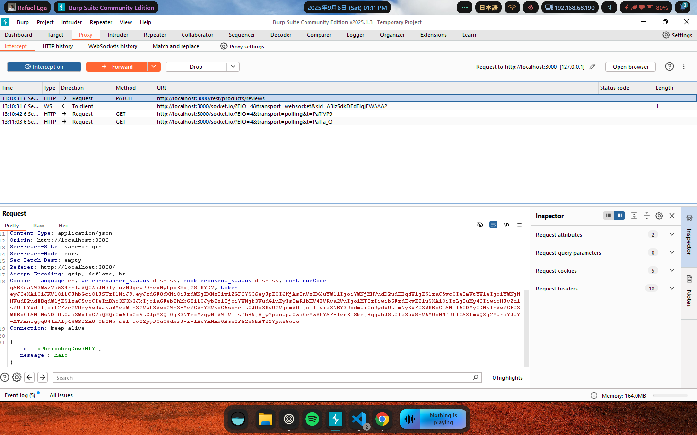
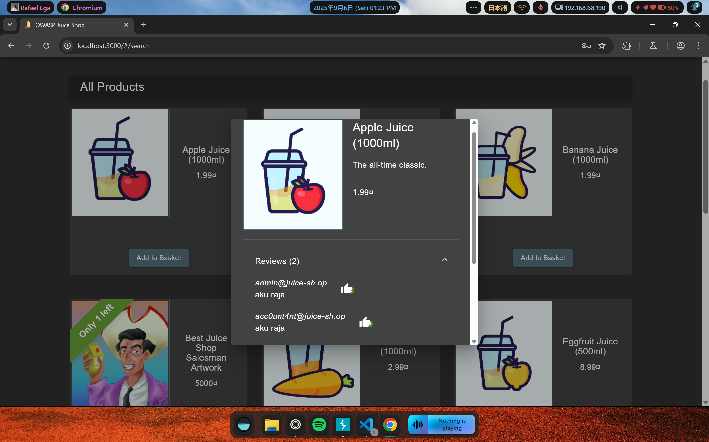

# Soal NoSQL Manipulation

**Description:** Update multiple product reviews at the same time.

**Resource:** https://demo.owasp-juice.shop/#/score-board?categories=Injection&showDisabledChallenges=false

## Langkah Pengerjaan:
1. Saya menemukan request HTTP PATCH yang digunakan untuk mengedit review di produk tertentu menggunakan BurpSuite Intercept

2. Untuk melakukan update review di beberapa produk sekaligus dalam 1 request, saya melakukan modifikasi pada JSON yang dikirimkan menjadi seperti ini
```
{
  "id": {"$ne": null},
  "message": "review-baru"
}
```

`$ne` merupakan salah satu operator pada MongoDB yang berarti `not equal/tidak sama dengan`, sehingga dengan modifikasi sebelumnya request yang dikirimkan akan berlaku pada setiap produk karena tidak ada review yang memiliki id null.
3. Berhasil mengupdate semua product review dengan kalimat yang sama sekaligus dalam satu waktu



Soal ini berhasil diselesaikan dengan mengikuti petunjuk pada write-up di https://github.com/Whyiest/Juice-Shop-Write-up/blob/main/4-stars/nosql_manipulation.md